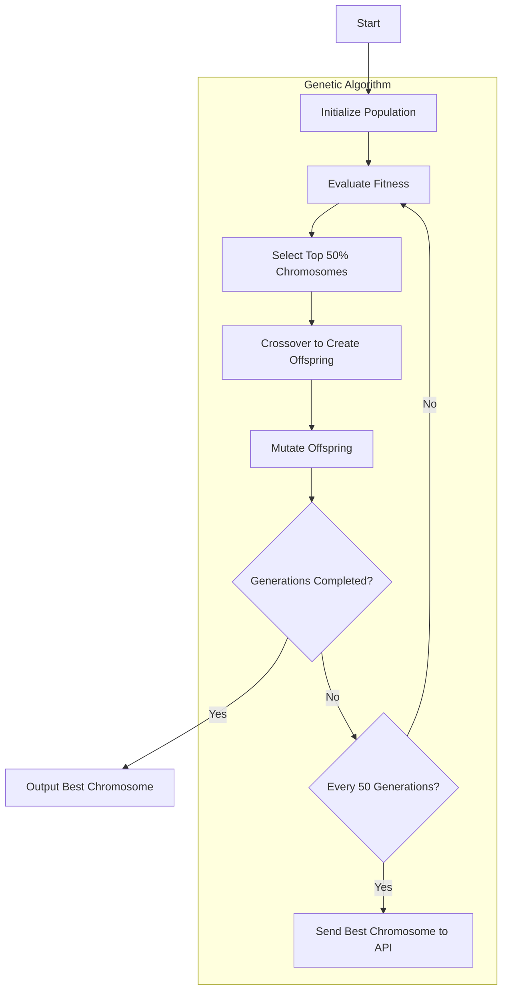

# Considition 2024 Hackathon Project

This project is developed for the [Considition hackathon](https://considition.com/) 2024. The goal of the hackathon is to optimize financial decisions for customers. The hackathon simulates various customer scenarios. The hackathon challenges participants to optimize financial decisions for a set of customers. Each customer has a unique personality and financial situation, and the goal is to maximize their happiness and financial stability over a specified period.

## Installation 
1. Clone the repository: 
```console
git clone git@github.com:Adilius/considition-2024.git
cd considition-2024
```

Install dependencies:
```console
npm install
```

3. Set up Docker:

Install Docker if you don't have it already.
Replace [YOUR API KEY] in the docker-compose.yml file with your API key, without any quotations.
Open a terminal in the Docker directory and run:
```console
docker compose up -d
```
Run the project:
```console
node starterkit.js
```

## Solution 
A [Genetic Algorithm](https://en.wikipedia.org/wiki/Genetic_algorithm) in this project is developed to find the optimal set of parameters for each customer to maximize their score. The genetic algorithm works as follows:

**Initialization:** A population of chromosomes is created, each representing a potential solution with random parameters.

**Evaluation:** Each chromosome's fitness is evaluated by calling the API that returns a score based on the parameters.

**Selection:** The top 50% best-performing chromosomes are selected based on their fitness scores.

**Crossover:** Selected chromosomes are combined to create new offspring, inheriting parameters from both parents.

**Mutation:** Small (mutationRate) random changes are introduced to the offspring to maintain genetic diversity.

**Iteration:** The process of evaluation, selection, crossover, and mutation is repeated for a specified number of generations.

**Result:** The best chromosome from the final generation is considered the optimal solution.


### Genetic Algorithm Flowchart

